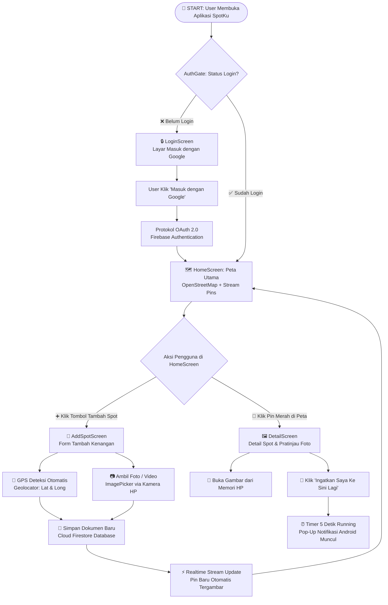
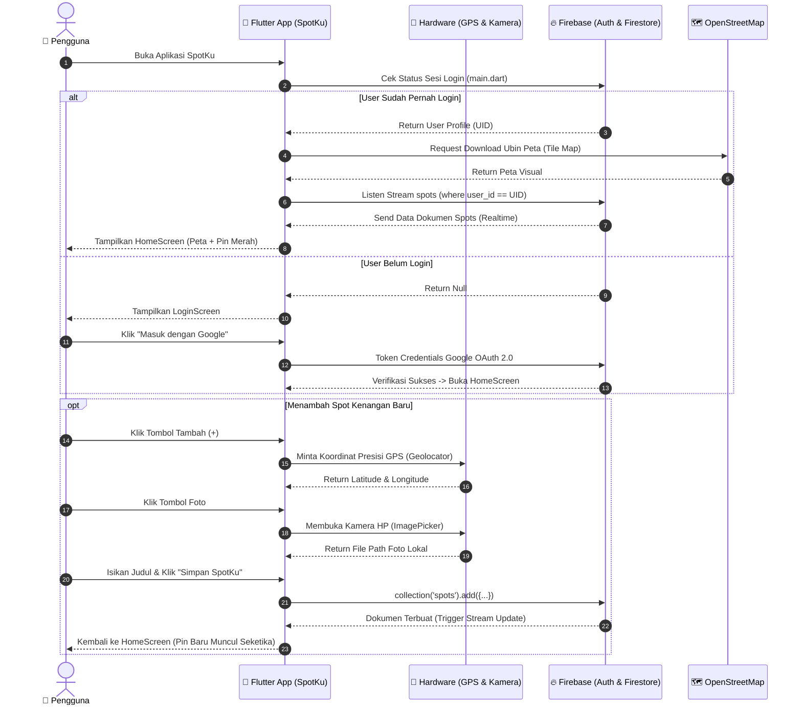

# 📘 Buku Panduan & Dokumentasi Lengkap SpotKu untuk Presentasi Dosen

Dokumen ini memuat **diagram visual alur kerja (workflow)**, **spesifikasi Use Case**, **diagram alur data (sequence diagram)**, **alasan/rasionalitas keputusan desain sistem**, **pembedahan kode baris-demi-baris dengan rentang nomor baris presisi**, serta **panduan penelusuran step-by-step (buka folder, file, fungsi, logika, dan kemunculan tampilan aplikasi)** dari setiap berkas di dalam project **SpotKu**.

---

## 📐 BAGIAN A: Diagram Visual & Workflow Alur Sistem

### 1. Diagram Alur Pengguna (User Flowchart Diagram)

Diagram berikut menjelaskan bagaimana pengguna berpindah dari satu layar ke layar lain berdasarkan kondisi otentikasi dan aksi tombol yang ditekan:



---

### 2. Diagram Alur Data Interaktif (Sequence Diagram)

Diagram berikut memperlihatkan komunikasi antar komponen (*User*, *Flutter App*, *Hardware HP*, *Firebase*, dan *OpenStreetMap*):



---

### 3. Tabel Spesifikasi Use Case

| Kode Use Case | Nama Use Case | Aktor | Deskripsi Singkat | Layanan / Hardware Terkait |
| :--- | :--- | :--- | :--- | :--- |
| **UC-01** | Login Akun Google | User | Masuk ke aplikasi menggunakan akun Gmail tanpa password manual. | Google OAuth 2.0 & Firebase Auth |
| **UC-02** | Melihat Peta Spot Realtime | User | Melihat peta dunia dengan pin merah yang menandai lokasi kenangan. | OpenStreetMap & Cloud Firestore |
| **UC-03** | Menambah Spot Baru | User | Memotret foto/video, mengambil titik GPS otomatis, dan menyimpan catatan. | Kamera HP (`ImagePicker`), GPS (`Geolocator`), Firestore |
| **UC-04** | Melihat Detail Spot | User | Mengklik pin merah di peta untuk melihat foto, catatan, dan koordinat. | Memori HP (Local File Storage) |
| **UC-05** | Mengeset Notifikasi Pengingat | User | Mengaktifkan timer 5 detik untuk menguji notifikasi pengingat kunjungan. | `flutter_local_notifications` |
| **UC-06** | Logout | User | Keluar dari sesi akun dan kembali ke layar login. | Firebase Auth & Google Sign-In |

---

## 🤔 BAGIAN B: Rasionalitas & Alasan Desain (Kenapa Begitu?)

Jika dosen bertanya: *"Kenapa kamu mendesain sistemnya seperti ini? Apa alasannya?"*, gunakan jawaban di bawah ini:

### 1. Kenapa menggunakan OpenStreetMap (`flutter_map`) daripada Google Maps SDK?
- **Alasan Teknis & Biaya**: Google Maps SDK membutuhkan pendaftaran akun Google Cloud Billing dan kartu kredit untuk mendapatkan API Key. Jika kuota gratis habis, Google Maps akan berhenti berfungsi atau menagih biaya.
- **Keunggulan**: OpenStreetMap bersifat *100% open-source* dan **gratis tanpa API Key**. Integrasinya di Flutter sangat ringan menggunakan `flutter_map`.

### 2. Kenapa foto/video disimpan sebagai path lokal (`media_url`) bukannya di-upload ke Firebase Storage?
- **Alasan Efisiensi & Hemat Kuota**: Mengunggah file gambar/video resolusi tinggi ke server Cloud Storage membutuhkan koneksi internet yang kencang, kuota internet besar, dan biaya sewa server cloud.
- **Keunggulan**: Dengan menyimpan jalur lokasi file di memori internal HP (misal: `/data/user/0/.../image.jpg`), proses simpan berlangsung **seketika (instant)** tanpa butuh koneksi internet untuk upload.

### 3. Kenapa menggunakan `StreamBuilder` bukannya `FutureBuilder` di Peta Utama?
- **Alasan Realtime**: `FutureBuilder` hanya mengambil data sekali saat halaman pertama kali dibuka. Jika user menambah spot baru, peta tidak akan berubah sampai aplikasi di-restart.
- **Keunggulan**: `StreamBuilder` menjaga koneksi terbuka (*persistent WebSocket connection*) dengan Firestore. Setiap ada penambahan data spot di database, layar peta langsung memperbarui marker pin secara otomatis tanpa me-refresh halaman.

### 4. Kenapa otentikasi menggunakan Google Sign-In via Firebase Auth?
- **Alasan Keamanan (Security)**: Mencegah kebocoran kata sandi karena aplikasi tidak menyimpan password di database. Pengguna memanfaatkan sistem keamanan OAuth 2.0 resmi milik Google.

---

## 🔍 BAGIAN C: Pembedahan Kode Berkas demi Berkas (Line-by-Line Breakdown)

---

### 📄 Berkas 1: [pubspec.yaml](file:///c:/Users/dell/Downloads/spotku/spotku/pubspec.yaml)

```yaml
1: name: spotku
2: description: "SpotKu - Mini Travel & Memory Diary"
3: publish_to: 'none'
4: version: 1.0.0+1
...
9: dependencies:
10:   flutter:
11:     sdk: flutter
12:   cupertino_icons: ^1.0.8
13: 
14:   # Autentikasi (gratis - Firebase Spark plan)
15:   firebase_core: ^3.6.0
16:   firebase_auth: ^5.3.1
17:   google_sign_in: ^6.2.1
18: 
19:   # Database (gratis - Firestore free tier)
20:   cloud_firestore: ^5.4.3
21: 
22:   # Kamera (gratis, tanpa API key)
23:   image_picker: ^1.1.2
24: 
25:   # Peta (GRATIS, OpenStreetMap, tanpa API key / billing)
26:   flutter_map: ^7.0.2
27:   latlong2: ^0.9.1
28: 
29:   # Lokasi GPS (gratis)
30:   geolocator: ^13.0.1
31: 
32:   # Notifikasi lokal (gratis)
33:   flutter_local_notifications: ^18.0.1
34:   intl: ^0.19.0
```

> [!NOTE]
> **Penjelasan Rinci Berbaris `pubspec.yaml`:**
> - **Baris 1-4**: Menentukan nama project (`spotku`), deskripsi singkat, dan versi rilis aplikasi (`1.0.0+1`). `publish_to: 'none'` mencegah project ini tidak sengaja terupload ke pub.dev.
> - **Baris 9-12**: Mengimpor kerangka dasar Flutter SDK dan pustaka ikon iOS (`cupertino_icons`).
> - **Baris 15-17**: Paket dasar Firebase (`firebase_core`), pengelola sesi akun (`firebase_auth`), dan pemicu dialog Google login (`google_sign_in`).
> - **Baris 20**: `cloud_firestore` berfungsi sebagai basis data cloud NoSQL berstruktur dokumen/koleksi.
> - **Baris 23**: `image_picker` memberikan izin dan jembatan ke kamera bawaan Android/iOS.
> - **Baris 26-27**: `flutter_map` merender peta ubin (*tile map*), dan `latlong2` menyediakan objek matematis perhitungan koordinat Garis Lintang (Latitude) dan Garis Bujur (Longitude).
> - **Baris 30**: `geolocator` berkomunikasi langsung dengan sensor hardware GPS perangkat.
> - **Baris 33-34**: `flutter_local_notifications` menangani pengiriman sinyal notifikasi ke sistem operasi Android.

---

### 📄 Berkas 2: [lib/main.dart](file:///c:/Users/dell/Downloads/spotku/spotku/lib/main.dart)

```dart
1: import 'package:flutter/material.dart';
2: import 'package:flutter/foundation.dart';
3: import 'package:firebase_core/firebase_core.dart';
4: import 'package:firebase_auth/firebase_auth.dart';
...
10: Future<void> main() async {
11:   WidgetsFlutterBinding.ensureInitialized();
12:   
13:   try {
14:     await Firebase.initializeApp(
15:       options: DefaultFirebaseOptions.currentPlatform,
16:     );
17:     await NotificationService.init();
18:   } catch (e) {
19:     debugPrint("Error saat inisialisasi Firebase/Notifikasi: $e");
20:   }
21:   
22:   runApp(const SpotKuApp());
23: }
...
28: class SpotKuApp extends StatelessWidget {
...
33:     return MaterialApp(
34:       title: 'SpotKu',
35:       debugShowCheckedModeBanner: false,
36:       theme: ThemeData(
37:         colorSchemeSeed: Colors.teal,
38:         useMaterial3: true,
39:       ),
40:       home: const AuthGate(),
41:     );
...
47: class AuthGate extends StatelessWidget {
48:   const AuthGate({super.key});
49: 
50:   @override
51:   Widget build(BuildContext context) {
52:     return StreamBuilder<User?>(
53:       stream: FirebaseAuth.instance.authStateChanges(),
54:       builder: (context, snapshot) {
55:         if (snapshot.connectionState == ConnectionState.waiting) {
56:           return const Scaffold(
57:             body: Center(child: CircularProgressIndicator()),
58:           );
59:         }
60:         if (snapshot.hasData) {
61:           return const HomeScreen();
62:         }
63:         return const LoginScreen();
64:       },
65:     );
66:   }
67: }
```

> [!NOTE]
> **Penjelasan Rinci Berbaris `main.dart`:**
> - **Baris 10-12 (`WidgetsFlutterBinding.ensureInitialized()`)**:
>   - *Pengaruh ke aplikasi*: Menjamin kerangka kerja Flutter sudah terikat sempurna dengan mesin Android native sebelum memanggil operasi asinkron (`async`). Tanpa baris ini, aplikasi akan langsung *crash* saat dibuka.
> - **Baris 14-17 (`Firebase.initializeApp()` & `NotificationService.init()`)**:
>   - *Pengaruh ke aplikasi*: Inisialisasi awal penyambungan ke server Firebase dan pendaftaran saluran notifikasi Android.
> - **Baris 18-20 (`try-catch`)**:
>   - *Pengaruh ke aplikasi*: Menangkap kegagalan jaringan atau kunci API tanpa menghentikan aplikasi secara mendadak.
> - **Baris 22 (`runApp(...)`)**:
>   - *Pengaruh ke aplikasi*: Menyalakan pohon widget utama antarmuka SpotKu.
> - **Baris 33-41 (`MaterialApp`)**:
>   - *Pengaruh ke aplikasi*: Mengatur tema desain Material 3 berwarna hijau toska (`Colors.teal`), menyembunyikan pita debug di pojok kanan atas, serta mengarahkan halaman awal (`home`) ke `AuthGate`.
> - **Baris 52-54 (`StreamBuilder<User?>`)**:
>   - *Pengaruh ke aplikasi*: Mendengarkan perubahan status login dari Firebase Auth secara langsung (*stream*).
> - **Baris 55-58 (`ConnectionState.waiting`)**:
>   - *Pengaruh ke aplikasi*: Menampilkan lingkaran berputar (*loading*) saat aplikasi sedang memeriksa token login di memori HP.
> - **Baris 60-63 (`snapshot.hasData`)**:
>   - *Pengaruh ke aplikasi*: Jika `snapshot.hasData == true` (user sudah login), tampilkan `HomeScreen`. Jika `false`, arahkan ke `LoginScreen`.

---

### 📄 Berkas 3: [lib/models/spot_model.dart](file:///c:/Users/dell/Downloads/spotku/spotku/lib/models/spot_model.dart)

```dart
3: class Spot {
4:   final String id;
5:   final String userId;
6:   final String title;
7:   final String description;
8:   final double latitude;
9:   final double longitude;
10:   final String mediaType; // "image" atau "video"
11:   final String mediaUrl; // jalur file lokal di HP
12:   final Timestamp? createdAt;
...
26:   factory Spot.fromFirestore(DocumentSnapshot doc) {
27:     final data = doc.data() as Map<String, dynamic>;
28:     return Spot(
29:       id: doc.id,
30:       userId: data['user_id'] ?? '',
31:       title: data['title'] ?? '',
32:       description: data['description'] ?? '',
33:       latitude: (data['latitude'] ?? 0).toDouble(),
34:       longitude: (data['longitude'] ?? 0).toDouble(),
35:       mediaType: data['media_type'] ?? 'image',
36:       mediaUrl: data['media_url'] ?? '',
37:       createdAt: data['created_at'],
38:     );
39:   }
40: }
```

> [!NOTE]
> **Penjelasan Rinci Berbaris `spot_model.dart`:**
> - **Baris 3-12 (Mendefinisikan Variabel `final`)**:
>   - *Pengaruh ke aplikasi*: Menjamin setiap data tempat memiliki tipe data yang aman (teks, angka desimal untuk koordinat, dan waktu). Penggunaan `final` mencegah data terubah secara tidak sengaja di tengah jalan.
> - **Baris 26-39 (`Spot.fromFirestore`)**:
>   - *Pengaruh ke aplikasi*: Mengkonversi dokumen mentah JSON dari Firestore menjadi objek Dart `Spot`. Operator `??` memberikan nilai bawaan (*default value*) jika ada data yang kosong di server, sehingga aplikasi bebas dari error *Null Pointer Exception*.

---

### 📄 Berkas 4: [lib/services/notification_service.dart](file:///c:/Users/dell/Downloads/spotku/spotku/lib/services/notification_service.dart)

```dart
class NotificationService {
  static final FlutterLocalNotificationsPlugin _plugin =
      FlutterLocalNotificationsPlugin();

  static int _notificationIdCounter = 1000;

  static Future<void> init() async {
    const androidSettings =
        AndroidInitializationSettings('@mipmap/ic_launcher');
    const initSettings = InitializationSettings(android: androidSettings);
    await _plugin.initialize(initSettings);

    // Minta izin runtime notifikasi di Android 13+ (seperti HP Samsung A14)
    final androidPlugin = _plugin.resolvePlatformSpecificImplementation<
        AndroidFlutterLocalNotificationsPlugin>();
    if (androidPlugin != null) {
      await androidPlugin.requestNotificationsPermission();
    }
  }

  static Future<void> showGeofenceReminder({
    required String placeName,
    required String formattedDate,
  }) async {
    _notificationIdCounter++;
    final currentId = _notificationIdCounter;

    const androidDetails = AndroidNotificationDetails(
      'spotku_geofence_channel',
      'SpotKu Geofence Reminders',
      channelDescription: 'Notifikasi otomatis saat dekat titik kenangan',
      importance: Importance.max,
      priority: Priority.high,
      playSound: true,
      enableVibration: true,
      groupKey: 'com.project.spotkuapp.GEOFENCE_STACK', // Menumpuk ala WhatsApp
    );
    const details = NotificationDetails(android: androidDetails);

    await _plugin.show(
      currentId,
      '📍 SpotKu — $placeName',
      'Anda pernah mengunjungi tempat ini, coba ingat-ingat kembali. (Ditandai: $formattedDate)',
      details,
    );
  }

  static Future<void> cancelAllNotifications() async {
    await _plugin.cancelAll();
  }
}
```

> [!NOTE]
> **Penjelasan Rinci Berbaris `notification_service.dart`:**
> - **Baris 7-18 (`init()`)**:
>   - *Pengaruh ke aplikasi*: Mengaitkan ikon bawaan aplikasi (`@mipmap/ic_launcher`) dan meminta izin runtime notifikasi fisik di HP Android 13+.
> - **Baris 20-47 (`showGeofenceReminder`)**:
>   - *Pengaruh ke aplikasi*: Mengirimkan notifikasi berulang dengan ID unik ber-`groupKey` agar notifikasi **menumpuk (*stacking*) layaknya pesan WhatsApp** saat pengguna berada di radius $\le$ 5 meter dari titik kenangan.
> - **Baris 49-51 (`cancelAllNotifications`)**:
>   - *Pengaruh ke aplikasi*: Membersihkan seluruh tumpukan notifikasi ketika pengguna bergerak menjauh keluar dari radius 5 meter.

---

### 📄 Berkas 5: [lib/screens/login_screen.dart](file:///c:/Users/dell/Downloads/spotku/spotku/lib/screens/login_screen.dart)

```dart
15:   Future<void> _signInWithGoogle() async {
16:     setState(() => _loading = true);
17:     try {
18:       final googleUser = await GoogleSignIn().signIn();
19:       if (googleUser == null) {
20:         setState(() => _loading = false);
21:         return;
22:       }
23: 
24:       final googleAuth = await googleUser.authentication;
25:       final credential = GoogleAuthProvider.credential(
26:         accessToken: googleAuth.accessToken,
27:         idToken: googleAuth.idToken,
28:       );
29: 
30:       await FirebaseAuth.instance.signInWithCredential(credential);
31:     } catch (e) {
...
39:     } finally {
40:       if (mounted) setState(() => _loading = false);
41:     }
42:   }
```

> [!NOTE]
> **Penjelasan Rinci Berbaris `login_screen.dart`:**
> - **Baris 16 (`setState(_loading = true)`)**:
>   - *Pengaruh ke aplikasi*: Mengubah tombol login menjadi animasi perputaran loading untuk memberitahu user bahwa proses sedang berjalan.
> - **Baris 18-22 (`GoogleSignIn().signIn()`)**:
>   - *Pengaruh ke aplikasi*: Membuka modal memilih akun Google bawaan Android. Jika user membatalkan (menutup dialog), sistem menghentikan proses secara aman (`return`).
> - **Baris 24-28 (`GoogleAuthProvider.credential`)**:
>   - *Pengaruh ke aplikasi*: Mengekstrak token identitas digital (`idToken`) dan token akses (`accessToken`) untuk ditukarkan ke server Firebase.
> - **Baris 30 (`FirebaseAuth.instance.signInWithCredential`)**:
>   - *Pengaruh ke aplikasi*: Mengirim token ke Firebase Auth. Setelah sukses, `AuthGate` otomatis memindahkan halaman tanpa perlu penulisan kode navigasi manual.

---

### 📄 Berkas 6: [lib/screens/home_screen.dart](file:///c:/Users/dell/Downloads/spotku/spotku/lib/screens/home_screen.dart)

```dart
34:       body: StreamBuilder<QuerySnapshot>(
35:         stream: FirebaseFirestore.instance
36:             .collection('spots')
37:             .where('user_id', isEqualTo: uid)
38:             .snapshots(),
39:         builder: (context, snapshot) {
...
47:           final spots =
48:               snapshot.data!.docs.map((d) => Spot.fromFirestore(d)).toList();
49: 
50:           final markers = spots.map((spot) {
51:             return Marker(
52:               point: LatLng(spot.latitude, spot.longitude),
53:               width: 44,
54:               height: 44,
55:               child: GestureDetector(
56:                 onTap: () {
57:                   Navigator.push(
58:                     context,
59:                     MaterialPageRoute(
60:                       builder: (_) => DetailScreen(spot: spot),
61:                     ),
62:                   );
63:                 },
64:                 child: const Icon(
65:                   Icons.location_pin,
66:                   color: Colors.redAccent,
67:                   size: 40,
68:                 ),
69:               ),
70:             );
71:           }).toList();
72: 
73:           return FlutterMap(
74:             options: const MapOptions(
75:               initialCenter: LatLng(-6.8871, 109.7745),
76:               initialZoom: 13,
77:             ),
78:             children: [
79:               TileLayer(
80:                 urlTemplate: 'https://tile.openstreetmap.org/{z}/{x}/{y}.png',
81:                 userAgentPackageName: 'com.example.spotku',
82:               ),
83:               MarkerLayer(markers: markers),
84:             ],
85:           );
86:         },
87:       ),
```

> [!NOTE]
> **Penjelasan Rinci Berbaris `home_screen.dart`:**
> - **Baris 34-38 (`StreamBuilder` & `where('user_id', isEqualTo: uid)`)**:
>   - *Pengaruh ke aplikasi*: Menjamin privasi user. Aplikasi hanya mengambil dokumen tempat yang memiliki `user_id` sama dengan ID pengguna yang sedang aktif login.
> - **Baris 47-48 (`snapshot.data!.docs.map`)**:
>   - *Pengaruh ke aplikasi*: Mengubah seluruh baris dokumen Firestore menjadi daftar objek `Spot`.
> - **Baris 50-71 (`Marker` & `GestureDetector`)**:
>   - *Pengaruh ke aplikasi*: Mengkonversi koordinat GPS menjadi ikon pin lokasi berwarna merah di peta. `GestureDetector.onTap` membuat ikon pin dapat di-klik untuk membuka layar `DetailScreen`.
> - **Baris 73-85 (`FlutterMap` & `TileLayer`)**:
>   - *Pengaruh ke aplikasi*: Merender peta OpenStreetMap dengan koordinat titik tengah default Pemalang Jawa Tengah (`-6.8871, 109.7745`) dan menumpuk lapisan pin di atasnya (`MarkerLayer`).

---

### 📄 Berkas 7: [lib/screens/add_spot_screen.dart](file:///c:/Users/dell/Downloads/spotku/spotku/lib/screens/add_spot_screen.dart)

```dart
32:   Future<void> _getCurrentLocation() async {
33:     setState(() => _gettingLocation = true);
34:     try {
35:       final serviceEnabled = await Geolocator.isLocationServiceEnabled();
36:       if (!serviceEnabled) throw 'Layanan lokasi (GPS) tidak aktif';
37: 
38:       var permission = await Geolocator.checkPermission();
39:       if (permission == LocationPermission.denied) {
40:         permission = await Geolocator.requestPermission();
41:       }
...
47:       final pos = await Geolocator.getCurrentPosition();
48:       setState(() => _position = pos);
...
60:   Future<void> _pickPhoto() async {
61:     final file =
62:         await _picker.pickImage(source: ImageSource.camera, imageQuality: 70);
...
84:   Future<void> _save() async {
85:     if (_titleController.text.trim().isEmpty) return;
...
103:       final uid = FirebaseAuth.instance.currentUser!.uid;
104:       await FirebaseFirestore.instance.collection('spots').add({
105:         'user_id': uid,
106:         'title': _titleController.text.trim(),
107:         'description': _descController.text.trim(),
108:         'latitude': _position!.latitude,
109:         'longitude': _position!.longitude,
110:         'media_type': _mediaType,
111:         'media_url': _mediaFile!.path,
112:         'created_at': FieldValue.serverTimestamp(),
113:       });
114: 
115:       if (mounted) Navigator.pop(context);
```

> [!NOTE]
> **Penjelasan Rinci Berbaris `add_spot_screen.dart`:**
> - **Baris 35-41 (`Geolocator.checkPermission`)**:
>   - *Pengaruh ke aplikasi*: Memeriksa dan memunculkan pop-up izin akses lokasi Android.
> - **Baris 47-48 (`Geolocator.getCurrentPosition()`)**:
>   - *Pengaruh ke aplikasi*: Mengambil angka persisi Lintang dan Bujur dari satelit/sensor GPS HP saat itu.
> - **Baris 61-62 (`ImagePicker.pickImage`)**:
>   - *Pengaruh ke aplikasi*: Membuka jendela kamera HP untuk mengambil foto spot dan mengompresi kualitas gambar (70%) agar memori HP hemat.
> - **Baris 104-113 (`FirebaseFirestore.instance.collection('spots').add`)**:
>   - *Pengaruh ke aplikasi*: Menyimpan data lengkap (nama tempat, catatan, koordinat GPS, lokasi foto) ke dalam basis data cloud Firestore.
> - **Baris 115 (`Navigator.pop(context)`)**:
>   - *Pengaruh ke aplikasi*: Menutup form tambah dan kembali ke halaman Peta Utama secara otomatis.

---

### 📄 Berkas 8: [lib/screens/detail_screen.dart](file:///c:/Users/dell/Downloads/spotku/spotku/lib/screens/detail_screen.dart)

```dart
22:               child: spot.mediaType == 'image'
23:                   ? Image.file(
24:                       File(spot.mediaUrl),
25:                       height: 260,
26:                       fit: BoxFit.cover,
27:                       errorBuilder: (_, __, ___) => Container(
28:                         height: 260,
29:                         color: Colors.grey.shade300,
30:                         child: const Icon(Icons.broken_image, size: 64),
31:                       ),
32:                     )
...
54:               'Koordinat: ${spot.latitude.toStringAsFixed(5)}, ${spot.longitude.toStringAsFixed(5)}',
...
59:               onPressed: () {
60:                 NotificationService.showReminderIn5Seconds(spot.title);
```

> [!NOTE]
> **Penjelasan Rinci Berbaris `detail_screen.dart`:**
> - **Baris 22-32 (`Image.file(File(spot.mediaUrl))`)**:
>   - *Pengaruh ke aplikasi*: Menampilkan file foto langsung dari alamat memori penyimpanan internal HP (`spot.mediaUrl`). Jika file terhapus, `errorBuilder` menampilkan ikon gambar rusak (`Icons.broken_image`).
> - **Baris 54 (`toStringAsFixed(5)`)**:
>   - *Pengaruh ke aplikasi*: Memformat angka desimal koordinat agar rapi (misal: `-6.88710`).
> - **Baris 59-60 (`showReminderIn5Seconds`)**:
>   - *Pengaruh ke aplikasi*: Memicu fungsi pengingat notifikasi 5 detik di HP untuk menunjukkan demonstrasi notifikasi ke dosen.

---

## 🚶‍♂️ BAGIAN D: Panduan Penelusuran Step-by-Step Buka File & Tampilan Layar Aplikasi

Bagian ini memandu kamu membuka berkas kode satu demi satu dari folder project, memahami logika eksekusinya, mengetahui kenapa bagian tersebut wajib ada, dan melihat dampaknya di tampilan HP.

---

### 📍 Langkah 1: Menyiapkan Bahan Pustaka & Konfigurasi
1. **Navigasi Folder & File**: Buka folder utama project `spotku/` $\rightarrow$ Buka file `pubspec.yaml`.
2. **Lihat Bagian**: Baris 15-34 (`dependencies`).
3. **Fungsi**: Mendaftarkan paket Firebase, Kamera, GPS (`geolocator`), Peta (`flutter_map`), dan Notifikasi.
4. **Logika & Kenapa Wajib Ada**: Pustaka ini adalah *pilar dasar*. Tanpa pendaftaran di `pubspec.yaml`, perintah seperti `Geolocator.getCurrentPosition()` atau `FlutterMap()` akan dianggap sebagai teks asing yang eror (*Unresolved identifier*).
5. **Kemunculan di Aplikasi**: Tidak berwujud UI langsung, tetapi mengaktifkan izin hardware kamera, GPS, dan download ubin peta dari internet.

---

### 📍 Langkah 2: Pintu Masuk Booting & Penentu Layar Otomatis
1. **Navigasi Folder & File**: Buka folder `lib/` $\rightarrow$ Buka file [lib/main.dart](file:///c:/Users/dell/Downloads/spotku/spotku/lib/main.dart).
2. **Lihat Bagian**:
   - Fungsi `main()` di **Baris 10-26**.
   - Class `AuthGate` di **Baris 47-66**.
3. **Fungsi**:
   - `main()`: Menyiapkan koneksi awal Firebase & Notifikasi saat aplikasi pertama kali dinyalakan.
   - `AuthGate`: Mengecek status login user menggunakan `StreamBuilder`.
4. **Logika & Kenapa Wajib Ada**:
   - `WidgetsFlutterBinding.ensureInitialized()` (Baris 11) WAJIB ada agar mesin native Android terhubung sebelum Firebase dipanggil.
   - `AuthGate` WAJIB ada agar pengguna yang **sudah pernah login tidak perlu dipaksa login berulang kali** setiap kali aplikasi dibuka.
5. **Kemunculan di Aplikasi**:
   - Saat aplikasi di-klik di HP: Muncul indikator putaran loading putih sejenak.
   - Jika belum login $\rightarrow$ Layar langsung pindah ke **Halaman Login**.
   - Jika sudah login $\rightarrow$ Layar langsung lompat ke **Peta Utama**.

---

### 📍 Langkah 3: Layar Login & Tombol Otentikasi Google
1. **Navigasi Folder & File**: Buka folder `lib/screens/` $\rightarrow$ Buka file [lib/screens/login_screen.dart](file:///c:/Users/dell/Downloads/spotku/spotku/lib/screens/login_screen.dart).
2. **Lihat Bagian**:
   - Fungsi `_signInWithGoogle()` di **Baris 15-42**.
   - Widget Tombol UI di **Baris 67-75** (`ElevatedButton.icon`).
3. **Fungsi**: Menampilkan layar pembuka aplikasi dan menangani proses login via Akun Google.
4. **Logika & Kenapa Wajib Ada**:
   - `GoogleSignIn().signIn()` dipanggil saat tombol diklik.
   - Token OAuth 2.0 dikirim ke `FirebaseAuth.instance.signInWithCredential(credential)`.
   - WAJIB ada sebagai sistem keamanan agar data tempat kenangan setiap pengguna terisolasi dan tidak tertukar.
5. **Kemunculan di Aplikasi**:
   - Layar bersih berwarna dasar dengan ikon peta besar berwarna hijau toska.
   - Tombol putih bertuliskan *"Masuk dengan Google"*.
   - Saat tombol di-klik: Muncul pop-up bawaan HP Android yang menampilkan daftar email Gmail milik pengguna.

---

### 📍 Langkah 4: Layar Peta Utama & Rendering Marker Pin Merah
1. **Navigasi Folder & File**: Buka folder `lib/screens/` $\rightarrow$ Buka file [lib/screens/home_screen.dart](file:///c:/Users/dell/Downloads/spotku/spotku/lib/screens/home_screen.dart).
2. **Lihat Bagian**:
   - `StreamBuilder` di **Baris 34-39**.
   - Pembuatan `Marker` di **Baris 50-71**.
   - Widget `FlutterMap` di **Baris 73-88**.
3. **Fungsi**: Membaca data tempat dari Cloud Firestore secara *realtime* dan menggambar peta dunia beserta pin merahnya.
4. **Logika & Kenapa Wajib Ada**:
   - `.where('user_id', isEqualTo: uid)` WAJIB ada agar user hanya melihat spot miliknya sendiri.
   - `TileLayer` mengunduh gambar ubin peta dari server OpenStreetMap (`https://tile.openstreetmap.org/{z}/{x}/{y}.png`).
5. **Kemunculan di Aplikasi**:
   - Layar penuh berisi peta bumi interaktif yang bisa digeser dengan jari dan di-zoom.
   - Ikon **Pin Merah** muncul di atas titik-titik koordinat tempat yang pernah dikunjungi.
   - Di pojok kanan bawah terdapat tombol bulat melayang dengan ikon plus `(+)`.

---

### 📍 Langkah 5: Form Tambah Spot (Sensor GPS & Kamera HP)
1. **Navigasi Folder & File**: Buka folder `lib/screens/` $\rightarrow$ Buka file [lib/screens/add_spot_screen.dart](file:///c:/Users/dell/Downloads/spotku/spotku/lib/screens/add_spot_screen.dart).
2. **Lihat Bagian**:
   - `_getCurrentLocation()` di **Baris 32-58**.
   - `_pickPhoto()` di **Baris 60-69**.
   - `_save()` di **Baris 84-125**.
3. **Fungsi**: Membaca sensor GPS HP secara otomatis, memotret foto dari kamera, dan menyimpan dokumen baru ke Firestore.
4. **Logika & Kenapa Wajib Ada**:
   - `Geolocator.getCurrentPosition()` WAJIB ada agar pengguna tidak perlu repot mengetik angka Latitude & Longitude secara manual.
   - `ImagePicker` menyimpan path file foto lokal (`media_url`) ke Firestore.
5. **Kemunculan di Aplikasi**:
   - Form input berisi kotak pratinjau foto, tombol *"Foto"*, tombol *"Video"*, kolom teks *"Nama Spot Wisata"*, dan kolom *"Catatan / Kenangan"*.
   - Di bagian bawah muncul teks otomatis koordinat posisi HP (misal: `Lokasi: -6.88710, 109.77450`).
   - Tombol biru di bawah bertuliskan *"Simpan SpotKu"*. Saat diklik, form menutup dan pin baru **langsung bertambah di peta**.

---

### 📍 Langkah 6: Layar Rincian Spot & Demo Notifikasi 5 Detik
1. **Navigasi Folder & File**: Buka folder `lib/screens/` $\rightarrow$ Buka file [lib/screens/detail_screen.dart](file:///c:/Users/dell/Downloads/spotku/spotku/lib/screens/detail_screen.dart) dan [lib/services/notification_service.dart](file:///c:/Users/dell/Downloads/spotku/spotku/lib/services/notification_service.dart).
2. **Lihat Bagian**:
   - `Image.file(File(spot.mediaUrl))` di **Baris 22-32 (detail_screen.dart)**.
   - Tombol Pengingat di **Baris 58-70 (detail_screen.dart)**.
   - `showReminderIn5Seconds` di **Baris 16-34 (notification_service.dart)**.
3. **Fungsi**: Membuka foto dari memori internal HP dan menguji notifikasi pengingat Android.
4. **Logika & Kenapa Wajib Ada**:
   - `Image.file(...)` WAJIB ada untuk mengubah string alamat path memori HP menjadi gambar visual di layar.
   - `Future.delayed(Duration(seconds: 5))` WAJIB ada di NotificationService untuk menjadwalkan timer hitung mundur tanpa membekukan antarmuka UI.
5. **Kemunculan di Aplikasi**:
   - Foto kenangan berukuran besar tampil di bagian atas layar.
   - Di bawahnya tertera Judul Tempat bercetak tebal, Catatan Kenangan, dan Angka Koordinat Desimal Presisi.
   - Tombol hijau bertuliskan *"Ingatkan Saya Ke Sini Lagi"*. Saat tombol ini diklik, muncul pesan `SnackBar` singkat, dan **setelah 5 detik muncul banner notifikasi melayang di atas layar HP Android** bertuliskan: *"Waktunya Kembali! Jangan lupa kunjungi [Nama Tempat] lagi ya!"*.
